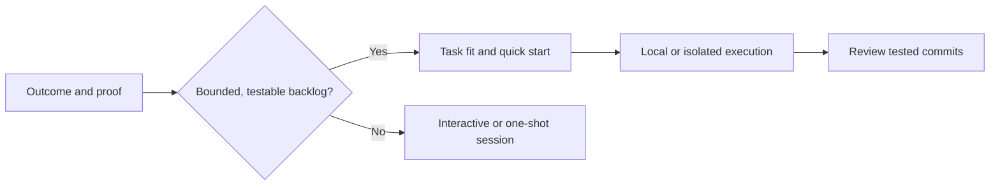

# Marketing Proof Plan

Status: Implemented

## Outcome

Make Ralph Workflow’s documentation answer three questions immediately: **what outcome it delivers**, **when it beats a one-shot coding session**, and **how developers retain control**.

## Scope

**Include**

- **Reframe** the home page around prepared backlog → tested, reviewable commits.
- **Add** task-fit and safety/control pages.
- **Align** navigation, metadata, README, and targeted How It Works copy.
- **Describe** trustworthy proof artifacts without inventing performance claims.

**Exclude**

- **Change** CLI, authentication, PAT permissions, containers, or GitHub behavior.
- **Create** a demo repository, video, telemetry, benchmarks, or deployment changes.
- **Rewrite** the complete usage guide or redesign the visual system.

## Acceptance Criteria

- [ ] **Explain** Ralph’s outcome, intended audience, and task boundary in the home-page first viewport.
- [ ] **Provide** a dedicated comparison between Ralph and one-shot work, including clear anti-fit cases and human review expectations.
- [ ] **Present** a proof framework that names inspectable run artifacts and contains no unverified data.
- [ ] **Qualify** isolation as credential-blast-radius reduction and distinguish local, container, and remote-Git modes.
- [ ] **Keep** navigation, README, titles, and page descriptions consistent with the new message.
- [ ] **Pass** the docs build and browser checks for the changed routes at mobile and desktop widths.

## Current Gap

- **Lead** with setup mechanics today: the home page prioritizes scaffolding, Dev Containers, credentials, and a long install transcript.
- **Hide** task fit today: visitors cannot quickly see when Ralph is preferable to a normal interactive agent session.
- **Fragment** trust today: safety language is overly absolute, while proof, task boundaries, and review guidance are absent from the first-reading path.

## Milestones

| Milestone | Deliverable | Completion signal |
| --- | --- | --- |
| **1. Create decision paths** | Add task-fit and safety/control routes; expose them in navigation. | Readers can choose an appropriate workflow before setup. |
| **2. Reframe first impression** | Rewrite the home hero and early sections around outcome, proof, fit, and optional isolation. | The primary CTA leads to evaluation rather than setup. |
| **3. Align entry points** | Update metadata, README opening, and How It Works introduction. | Every entry point uses the same scoped promise. |
| **4. Verify experience** | Build the docs and exercise navigation and layouts in a browser. | Changed routes work without console errors at 320px and desktop. |

## Implementation Design

**Guide** first-time readers through this sequence:

**Keep** the current dark visual system and static Next.js architecture. **Separate** evaluation content from detailed setup by adding two focused pages:

- **Task fit:** Compare Ralph with a one-shot session, show fit/anti-fit, and set review expectations.
- **Safety and control:** Explain setup modes, iteration limits, inspectable artifacts, and scoped isolation claims.

**Frame** proof as a checklist of artifacts to inspect: starting commit, PRD, command and iteration cap, terminal record, git log, test results, and human review. **Avoid** linking to or implying a demo that does not exist.

## File Map

| File | Change |
| --- | --- |
| `docs/app/page.tsx` | **Rewrite** hero and early sections around outcome, proof, task fit, and optional isolation. |
| `docs/app/is-ralph-right-for-me/page.tsx` | **Add** one-shot comparison and task-fit guidance. |
| `docs/app/safety-and-control/page.tsx` | **Add** scoped safety and operational-control guidance. |
| `docs/components/Navbar.tsx` | **Expose** both decision resources on desktop and mobile. |
| `docs/app/layout.tsx` | **Improve** default metadata. |
| `docs/app/how-it-works/page.tsx` | **Lead** with loop mechanics and qualify isolation copy. |
| `readme.md` | **Align** opening copy and documentation links. |

## Verification

- **Run** `npm test` and `npm run docs:build`.
- **Check** Home, Usage Guide, How It Works, Task Fit, and Safety & Control through the site navigation.
- **Inspect** changed pages at 320px and desktop width for layout, keyboard access, links, and console errors.
- **Review** the final diff for unsupported claims, accessibility regressions, and copy consistency.

## Risks, Dependencies, and Assumptions

- **Avoid** overpromising agent reliability by pairing the promise with task-fit boundaries and human review.
- **Preserve** the existing navigation focus with concise labels and no new dependencies.
- **Treat** checked-in generated `docs/out/` artifacts as build output; rebuild rather than edit them manually, then confirm whether repository policy requires committing them.
- **Assume** no verified public demo repository exists; present a proof framework only.
- **Assume** Claude, Codex, Gemini, and OpenCode remain supported; avoid implying identical behavior across providers.

## Approval Needed

**Record** browser automation as follow-up: `agent-browser` is unavailable in this workspace, so interactive browser verification could not run. Static route rendering, type checking, package tests, and production build verification completed.
